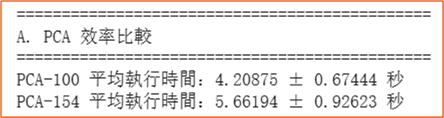
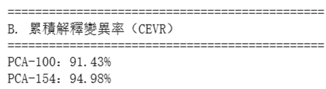
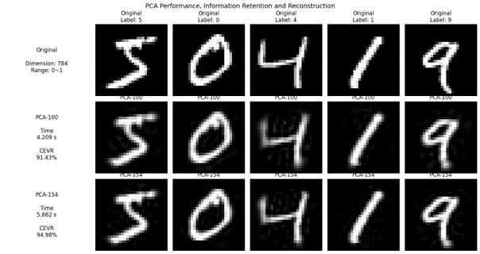
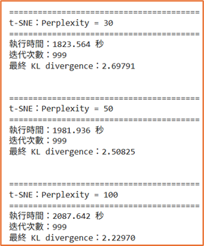
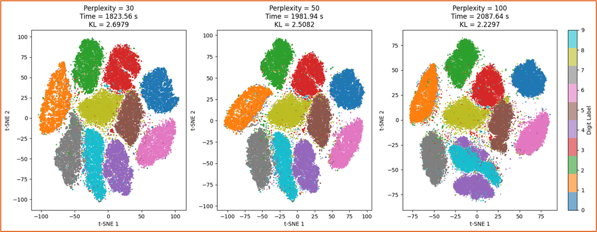
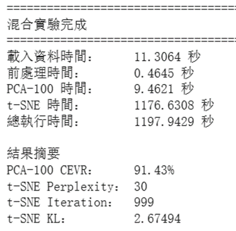
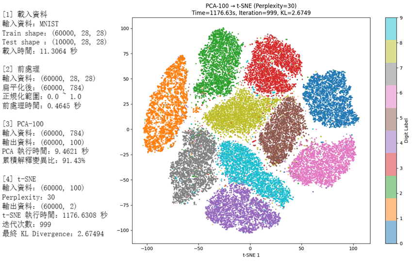

# MNIST 降維 (Dimensionality Reduction) 與聚類 (Clustering)

本專案以 MNIST 資料集進行降維實驗，主要探討 PCA 與 t-SNE 的降維方法、參數設定及實驗結果

實驗內容包含

資料前處理：Flatten、Linear Normalization

PCA：比較 100 維與 154 維的運算效率、資訊保留程度與重建結果

t-SNE：比較 Perplexity = 30、50、100 對二維分布、KL Divergence 與運算時間的影響

混合實驗：將 PCA-100 與 t-SNE（Perplexity = 30）串聯，建立完整的降維流程

本專案主要透過實驗結果比較不同降維設定對資訊保留、視覺化結果與運算成本的影響

# MNIST資料介紹

MNIST 是由手寫數字影像所組成的資料集，本專案使用 Train 組資料進行降維實驗

使用 Train 組共 60000 筆樣本

每筆樣本為 28 × 28 的灰階影像

每張影像包含 784 個像素變數

原始像素值範圍為 0～255

# 資料前處理

## 扁平化

MNIST 原始資料為 28 × 28 的二維影像，而 PCA 的輸入需要以矩陣形式表示，因此將每張影像展開為一維向量

28 × 28 → 784

## 正規化

資料中的不同變數若具有不同的數值尺度，在進行距離、變異量等計算時，數值範圍較大的變數可能對結果產生較大的影響

=>正規化的目的不是讓電腦比較容易計算，而是降低資料尺度對後續演算法計算結果的影響，使不同變數的數值具有可比較的尺度

本實驗將像素值由 0～255 轉換至 0～1

由於 MNIST 像素值具有明確的固定範圍，因此採用線性正規化進行等比例縮放

# PCA降維數量對效率影響

## 目的

比較 PCA 保留不同主成分數量時，對降維運算效率的影響

PCA 保留的主成分數量不同，代表需要計算與輸出的特徵數量不同

因此比較 PCA-100 與 PCA-154 完成降維所需的平均執行時間

透過相同的輸入資料、前處理方式與執行環境，僅改變保留的主成分數量，觀察降維維度增加後對運算成本的影響

## 效率結果

PCA-100 的平均執行時間為 4.21 秒

PCA-154 的平均執行時間為 5.66 秒

PCA-154 相較於 PCA-100 平均增加約 1.45 秒

相對增加約 34.5%

當保留的主成分數量由 100 增加至 154 時，平均執行時間也隨之增加

表示在其他條件相同的情況下，保留更多主成分會增加 PCA 的運算成本

PCA-100：4.21 秒  

PCA-154：5.66 秒

## 不同解釋度結果

PCA-100 的累積解釋變異比為 91.43%

表示保留前 100 個主成分後，可以解釋原始資料約 91.43% 的總變異量

PCA-154 的累積解釋變異比為 94.98%

表示保留前 154 個主成分後，可以解釋原始資料約 94.98% 的總變異量

PCA-154 相較於 PCA-100 增加 54 個主成分

累積解釋變異比由 91.43% 提升至 94.98%，增加 3.55 個百分點

表示增加第 101～154 個主成分後，雖然可以保留更多原始資料的變異資訊，但新增的資訊保留量相對有限

隨著主成分數量增加，後續主成分所能提供的新增變異資訊逐漸降低

## 結論

PCA-100 與 PCA-154 的比較顯示，增加主成分數量可以提高資訊保留程度，但同時會增加運算成本

PCA-154 相較於 PCA-100

平均執行時間增加約 34.5%

累積解釋變異比僅增加 3.55 個百分點

因此，本實驗後續選擇 PCA-100，在資訊保留與運算效率之間取得平衡

# 額外實驗結果-主成分91%、94.98%是什麼意思

PCA 會將原始資料的變異依照各主成分能解釋的程度由高至低排列

因此，累積解釋變異比（Cumulative Explained Variance Ratio, CEVR）可以用來表示保留前 k 個主成分後，原始資料的總變異有多少被保留下來

PCA-100 的累積解釋變異比為 91.43%

代表保留前 100 個主成分後，這 100 個主成分合計可以解釋原始資料約 91.43% 的變異

PCA-154 的累積解釋變異比為 94.98%

代表保留前 154 個主成分後，這 154 個主成分合計可以解釋原始資料約 94.98% 的變異

因此，PCA-100 與 PCA-154 的差異並不是代表影像分別「保留 91.43% 與 94.98% 的像素」

而是代表降維後所保留的主成分，可以解釋原始資料總變異的比例

增加 54 個主成分後

91.43% → 94.98%

增加 3.55 個百分點

=>PCA-154 比 PCA-100 保留更多原始資料的變異資訊，但新增的 54 個主成分所帶來的額外解釋能力相對有限
## 對影像重建的影響

CEVR 可以量化資料變異的保留程度，但無法直接呈現這些資訊損失在原始影像上造成的影響

因此將 PCA-100 與 PCA-154 的結果透過 `inverse_transform()` 重建回原始 784 維空間，再重新轉換為 28 × 28 影像

PCA-100 重建後仍能保留原始數字的主要輪廓，但部分邊緣與細節較為模糊

PCA-154 重建結果則較接近原始影像，能保留較多影像細節

這顯示增加主成分所保留的額外變異資訊，會反映在重建影像的細節上

# t-SNE不同Perplexity的效率影響

## 目的

比較不同 Perplexity 設定對 t-SNE 運算效率與二維分布結果的影響

在相同資料、相同迭代次數與相同執行環境下，僅改變 Perplexity = 30、50、100

透過比較不同設定下的執行時間、KL Divergence 與二維分布，觀察 Perplexity 改變對 t-SNE 降維結果與運算成本的影響

## 效率結果

| Perplexity | 執行時間 | 迭代次數 | KL Divergence |
| --- | ---: | ---: | ---: |
| 30 | 1823.56 秒 | 999 | 2.69791 |
| 50 | 1981.94 秒 | 999 | 2.50825 |
| 100 | 2087.64 秒 | 999 | 2.22970 |

Perplexity = 30 時，執行時間為 1823.56 秒

Perplexity = 50 時，執行時間為 1981.94 秒，相較於 Perplexity = 30 增加約 8.7%

Perplexity = 100 時，執行時間為 2087.64 秒，相較於 Perplexity = 30 增加約 14.5%

三組實驗皆執行 999 次迭代，因此執行時間差異並非來自迭代次數不同

當 Perplexity 增加時，t-SNE 的執行時間也隨之增加

表示在本次實驗中，提高 Perplexity 會增加運算成本

## KL Divergence結果

Perplexity = 30：2.69791

Perplexity = 50：2.50825

Perplexity = 100：2.22970

Perplexity 從 30 增加至 100 時，KL Divergence 由 2.69791 降低至 2.22970

表示在本次實驗中，Perplexity 提高後，最終高維空間與低維空間之間的機率分布差異降低

## 二維分布結果

### Perplexity = 30

10 個數字類別皆形成明顯的群聚

各類別大致維持獨立分布，類別之間的重疊程度較低

### Perplexity = 50

整體二維分布與 Perplexity = 30 相近

各類別仍維持明顯群聚，整體分布沒有明顯改變

### Perplexity = 100

部分類別的分布產生較明顯變化

其中 4 與 9 的區域出現較多樣本混雜

相較於 Perplexity = 30 與 50，部分類別之間的邊界較不明顯

## 二維分布分析

Perplexity 控制 t-SNE 建立局部鄰近關係時所考慮的鄰域尺度

當 Perplexity 提高時，考慮的鄰近樣本範圍擴大

因此原本的局部結構會受到更多周圍樣本的影響

在本次實驗中，Perplexity = 30 與 50 的二維分布較為相近

當 Perplexity 提高至 100 時，部分類別出現較明顯的混雜，其中 4 與 9 的區域較為明顯

## 結論

Perplexity 增加時，t-SNE 的執行時間增加，而 KL Divergence 降低

Perplexity = 30 與 50 的二維分布結果相近，皆能形成明顯的類別群聚

Perplexity = 100 雖然 KL Divergence 較低，但部分類別出現較明顯的混雜

綜合執行時間、KL Divergence 與二維分布結果，後續混合實驗採用 Perplexity = 30

# 額外實驗-T-SNE為什麼會發生混雜

## 高維空間的相似度

t-SNE 會將高維空間中樣本之間的距離轉換為相似度機率

\[
p_{j|i}
=
\frac{
\exp\left(-\frac{\|x_i-x_j\|^2}{2\sigma_i^2}\right)
}{
\sum_{k\neq i}
\exp\left(-\frac{\|x_i-x_k\|^2}{2\sigma_i^2}\right)
}
\]

其中

- \(x_i\)：第 \(i\) 個樣本
- \(x_j\)：第 \(j\) 個樣本
- \(\|x_i-x_j\|\)：兩個樣本在高維空間中的距離
- \(\sigma_i\)：第 \(i\) 個樣本的 Gaussian kernel 寬度

## Perplexity與鄰域範圍

Perplexity 定義為

\[
Perp(P_i)=2^{H(P_i)}
\]

其中 Shannon entropy 為

\[
H(P_i)
=
-\sum_j p_{j|i}\log_2 p_{j|i}
\]

Perplexity 越高，代表需要考慮的有效鄰域越大

為了達到指定的 Perplexity，t-SNE 會調整 \(\sigma_i\)

當 Perplexity 提高時，\(\sigma_i\) 通常會增加，使 Gaussian kernel 的影響範圍擴大

## 為什麼會產生混雜

由

\[
p_{j|i}
\propto
\exp\left(
-\frac{\|x_i-x_j\|^2}{2\sigma_i^2}
\right)
\]

可以看出，當 \(\sigma_i\) 增加時，相同距離下的相似度衰減程度降低

因此距離較遠的樣本也會具有較高的相似度機率

也就是更多鄰近樣本會被納入第 \(i\) 個樣本的局部結構

當不同類別的樣本彼此接近時，較大的 Perplexity 會使這些跨類別樣本的相似度關係增加

因此在低維空間中，原本較明確的類別局部結構可能受到其他類別樣本影響，進而產生重疊

## 本次實驗

Perplexity = 30、50 時，二維分布較為相近

當 Perplexity = 100 時，4 與 9 的區域出現較明顯的樣本混雜

因此本次實驗觀察到

\[
Perplexity\uparrow
\Rightarrow
\sigma_i\uparrow
\Rightarrow
有效鄰域範圍\uparrow
\Rightarrow
更多周圍樣本參與相似度計算
\Rightarrow
局部類別結構受到更多影響
\Rightarrow
部分類別產生重疊
\]

# 混合實驗

## 實驗目的

將前面 PCA 與 t-SNE 的實驗結果整合，建立完整的降維流程

本實驗先使用 PCA 將原始 784 維資料降至 100 維，再將 PCA 結果輸入 t-SNE，使用 Perplexity = 30 將資料進一步降至 2 維

完整流程為

784 維
↓
PCA-100
↓
t-SNE（Perplexity = 30）
↓
2 維

選擇 PCA-100 是因為其累積解釋變異比已達 91.43%，同時相較於 PCA-154 具有較低的運算成本

t-SNE 則選擇 Perplexity = 30，因為在前面的實驗中，其二維分布能形成明顯群聚，且具有較低的運算時間

## 實驗流程

原始 MNIST 資料首先經過 Flatten 與 Linear Normalization，將每張 28 × 28 影像轉換為 784 維向量並將像素值縮放至 0～1

接著使用 PCA 將資料由 784 維降至 100 維

最後將 PCA-100 的結果輸入 t-SNE，設定 Perplexity = 30，將資料降至 2 維進行視覺化

## 各階段執行時間

| 階段 | 執行時間 |
| --- | ---: |
| 資料載入 | 11.31 秒 |
| 資料前處理 | 0.46 秒 |
| PCA-100 | 9.46 秒 |
| t-SNE | 1176.63 秒 |

整體流程中，t-SNE 的執行時間約佔總執行時間 98.2%

因此，本次混合實驗的主要運算成本來自 t-SNE，而 PCA 所增加的時間相對較低

## 最終二維結果

經過 PCA-100 與 t-SNE 後，原始 784 維資料被轉換為 2 維表示

10 個數字類別在二維空間中形成明顯的群聚

部分類別之間仍存在少量重疊，但整體仍能觀察到不同數字類別的分布結構

## 混合實驗結論

本實驗將 PCA 與 t-SNE 串聯，建立

784 → 100 → 2

的降維流程

PCA 主要負責降低原始資料維度，減少後續 t-SNE 的輸入維度

t-SNE 則進一步將資料轉換為二維表示，用於觀察資料的局部分布與群聚結構

最終結果顯示，PCA-100 搭配 Perplexity = 30 可以在保留主要變異資訊的情況下，將 MNIST 資料進一步轉換為具有明顯群聚結構的二維表示
